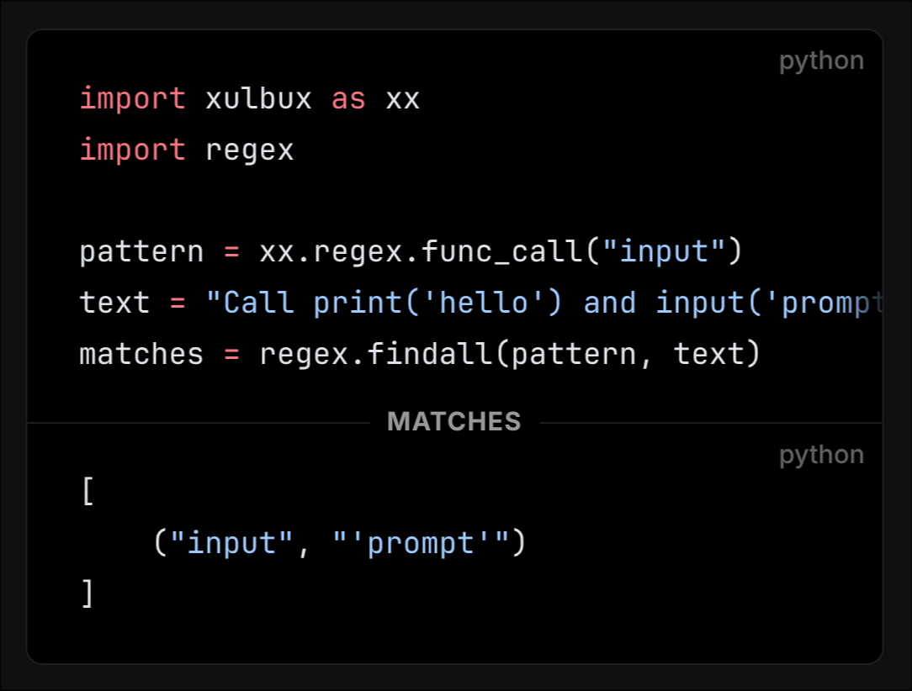
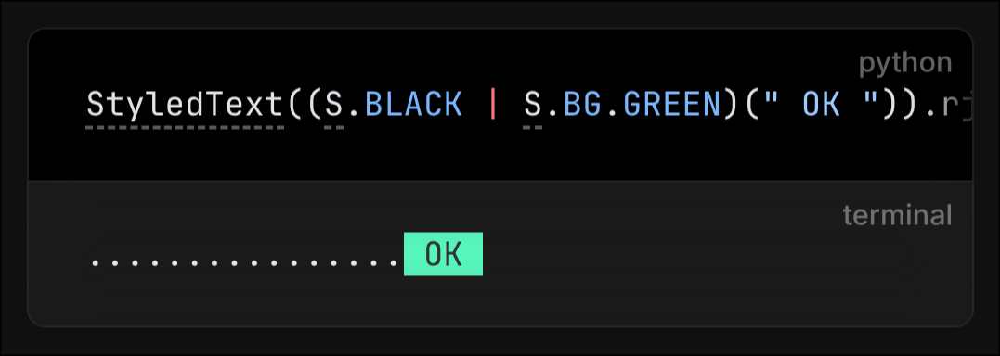

# docs-xulbux

When working in the `xulbux` repository, any AI agent or automated assistant MUST adhere strictly to the following rules regarding documentation, docstrings, and code comments.

## 1. Docstrings

### General Rules

1. **Mandatory Documentation:** Everything in the library's source code that is not private (or special modified things like custom dunderscore methods) requires a docstring.
2. **Parameters (`__init__` vs Classes):** For classes that take parameters, document the parameters in the **class's docstring**. Do NOT add a docstring to the `__init__` method itself. (This ensures params are displayed in the signature of the class in the docs).
3. **Parameters List:** Docstrings for signatures that have params MUST list those params in the exact same order as the signature, **without type-hints**, and quickly describe what each param is for.
4. **Returns & Yields:** Do **NOT** describe the return/yield value unless it is special, complex, or cannot be inferred from the type hinting.
5. **Exceptions:** If a function/method raises special exceptions for specific reasons, describe that in the docstring.
6. **Attributes & Properties:** Document public class/instance attributes or properties directly below their variable/property definitions, _not_ in the class docstring (see `console.ArgumentParser` for an example).
7. **Examples:** Always add one or more example usages if the function/class is large or quite complicated to understand.

### Formatting & Line Wraps

1. **Spacing After Docstring:** There must ALWAYS be exactly **ONE empty line** between a docstring and the following code/content of a function, method, or class. (The only exception is inline variable/attribute documentation, such as variable definitions inside `__init__` methods, where no empty line is placed between adjacent variable definitions).
2. **Text Width:** The content of a docstring MUST be wrapped to a maximum width of **99 characters**.
3. **Line Breaks:** Use `<br>` for line wraps within a paragraph, not `\n`. Only use `\n` if there should be a larger space (like a paragraph break) after the wrap.
4. **Horizontal Rules (HRs):** HRs (`----------------------------------------------------------------------------------------------------`) must ALWAYS be exactly **100 characters** long, regardless of how wide the text content is.
5. **HR Padding:** If the next line is a HR, the current line must end in `\n` to prevent rendering glitches.
6. **Styling & Tags:**
   - **Bold:** Use Markdown `**bold text**`.
   - **Italics:** Do **NOT** use italics (it breaks in some IDEs).
   - **Inline Code/Expressions:** Use backticks `` ` `` for variables, expression parts, and inline code.
   - **Headers:** Use `#### Some Title` (Markdown H4) only for section headers, and only as the first thing inside a docstring's section.
   - **HTML:** Do NOT use any HTML tags besides `<br>` and the special docs components defined below.

### Structure of a Docstring

Follow this exact structure and formatting style. You may omit sections if they don't apply, but if included, they MUST be in this order and style:

````python
"""A short 1-2 line long description of the var/func/class does.\n
----------------------------------------------------------------------------------------------------
*   `param1` – Short description of the first param.
*   `param2` – Longer description of the second param, which is too long to<br>
    fit within the 99 character limit, so it will be wrapped to the next line.
*   `param3` – Short description of the last param.\n
----------------------------------------------------------------------------------------------------
Raises `SomeError` if some condition is met during execution.\n
----------------------------------------------------------------------------------------------------
**Attention:** Something important the user should be aware of when using this var/func/class.\n
----------------------------------------------------------------------------------------------------
#### Example Usages

**Example 1:**
```python
...
```

**Example 2:**
```python
...
```"""
````

### Module Docstrings

The HR and text width rules above do **NOT** apply to module-level docstrings (the docstrings placed at the very top of a module file):

- **Text Width:** Content in module docstrings has a maximum width of **127 characters** (matching the repo's max linting line-length).
- **Horizontal Rules:** Use standard Markdown `---` (three characters wide) with an empty line before and after them, following standard Markdown linting rules.

## 2. Special Docs Components

These are HTML comments used to render custom blocks on the generated docs website.

### Attached Code

Mainly used to show the output/result of a code example. In the IDE, this will look like a normal code block, but on the website, it will be styled specifically as an attached output block.

**Format:**

````python
"""…\n
----------------------------------------------------------------------------------------------------
#### Example Usage

```python
import xulbux as xx
import regex

pattern = xx.regex.func_call("input")
text = "Call print('hello') and input('prompt') and print('world')"
matches = regex.findall(pattern, text)
```

<!-- DOCS: <AttachedCode> -->
Matches:

```python
[
    ("input", "'prompt'")
]
```
<!-- DOCS: </AttachedCode> -->"""
````

**Result on website:**


### Terminal Output

Used to display the output of a terminal-outputting code example. Note that this won't be rendered at all in an IDE's docstring render, but it will render properly with colors on the docs website.

**Format:**

````python
"""…\n
----------------------------------------------------------------------------------------------------
#### Example Usage

```python
StyledText((S.BLACK | S.BG.GREEN)(" OK ")).rjust(20, ".").print()
```

<!-- DOCS: <TerminalOutput>
................<span class="black bg-green"> OK </span>
</TerminalOutput> -->"""
````

**Result on website:**


_Note on Terminal Output Colors:_ Classes for all default terminal styles/colors are predefined. Custom terminal styles are available in `docs/src/.vitepress/theme/style.css` under `/* Terminal Output Styles */`. If a needed color isn't there, define a new one.

## 3. Comments

### General Rules

1. **Inline Code:** Always use backticks `` ` `` for variables and other inline-code inside comments. Do NOT use normal quotes for this.
2. **Comment Length:** Prefer single-line comments. If a comment must span multiple lines, keep it to a maximum of **two lines** (max 2 lines).
3. **Block Comments:** If a comment is written on its own line to describe upcoming line(s) of code:
   - For single-line comments, end with a colon `:`.
   - For multi-line comments (max 2 lines), preceding lines can end normally in a period `.`, and only the last line must end with a colon `:`.
4. **Inline Comments:** If a comment is written on the same line, behind code, always end it with a period `.`.

### Section Separators

Section separators help organize the code and must follow strict width and casing rules.

- **Top-Level Separators:** These must be exactly **127 characters** wide (the max linting line-length).
- **Internal Separators (Inside definitions):** These must be exactly **65 characters** wide.
- **Text Formatting:** The text within the separator must be **ALL UPPERCASE**, except for inline-code which should just use normal casing (do not encase it in backticks in the separator).
- **Padding:** Pad with `*`. If both sides cannot have the exact same number of `*` characters to equal the target width, the left side should have **one less** `*` character than the right side.

**Example (Top-Level - 127 characters wide):**

```python
# ****************************************************** Throbber TESTS *******************************************************
```

**Example (Internal - 65 characters wide):**

```python
# ******************** CUSTOM COLORS & LINKS ********************
```
